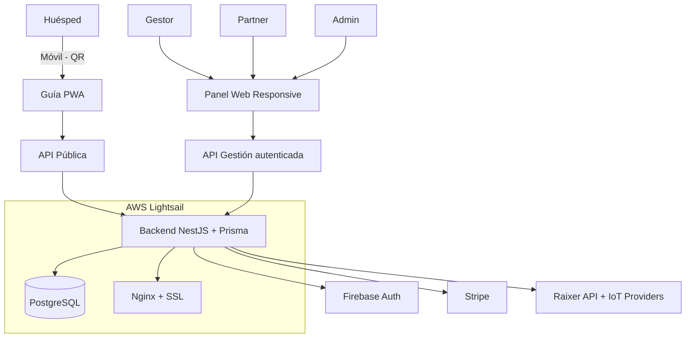

# SmartStay Guide - Backend

**Plataforma SaaS para gestión de guías turísticas inteligentes y control de accesos de pisos turísticos**

Permite a **gestores de pisos turísticos** ofrecer guías dinámicas a huéspedes y controlar accesos, y a **comercios y restaurantes** promocionarse en dichas guías según zonas de la ciudad mediante suscripciones.

---

## 🏗️ Estado Actual del Backend

### ✅ Funcionalidades Implementadas

| Fase | Módulo                            | Estado                                                                   |
| ---- | --------------------------------- | ------------------------------------------------------------------------ |
| 1    | Schema Base (Prisma + PostgreSQL) | ✅ User, Company, Apartment, Unit, ActivityLog, AccessLog, BillingHistory |
| 2    | Firebase Authentication           | ✅ Guards, Decorators, Endpoints `/auth/firebase/*`                       |
| 3    | IoT Multi-Provider                | ✅ Raixer implementado, Factory pattern, AccessLog                        |
| 4    | Stripe Billing + Webhooks         | ✅ Pagos, Suscripciones, Webhooks, BillingHistory                         |
| 5    | EncryptionService                 | ✅ AES-256-CBC para datos sensibles, Feature flag                         |
| 6    | ManagerModule + Upload            | ✅ CRUD Apartamentos, Encriptación de accessCode, Upload de imágenes      |
| 7    | Multi-Provider IoT                | ✅ Shelly, Sonoff, Home Assistant, Nuki, Generic HTTP (Factory)           |
| 8    | Admin Panel                       | ✅ User/Company CRUD, Role-based access, Activity Logging                 |
| 9    | Email Notifications               | ✅ Stub de EmailService (SendGrid/Mailgun)                                |
| 10   | Analytics                         | ✅ Métricas de uso, logs, estadísticas por apartamento                    |

### 🔒 Auditoría de Seguridad

* Auditoría completa realizada, todas las vulnerabilidades críticas y altas corregidas
* Endpoints críticos (`/api/public/actions/open-lock`) ahora requieren **token válido**
* `AdminGuard` y `FirebaseAuthGuard` reforzados
* Logging completo en `ActivityLog`, `AccessLog` y `BillingHistory`
* Encriptación AES-256-CBC aplicada a todos los datos sensibles
* Reportes disponibles:

  * `SECURITY-AUDIT-REPORT.md`
  * `SECURITY-FIXES-APPLIED.md`

---

## 📦 Estructura del Proyecto

```
backend/
├── prisma/
│   └── schema.prisma
├── src/
│   ├── auth/                  # Firebase Auth
│   ├── billing/               # Stripe Billing + Webhooks
│   ├── companies/
│   ├── apartments/            # CRUD + reglas + guide generation
│   ├── rules/                 # ApartmentRules / surveys
│   ├── devices/               # IoT providers + locks
│   ├── guides/                # Guías dinámicas
│   ├── partners/
│   ├── zones/
│   ├── surveys/
│   ├── public/                # Endpoints públicos para frontend
│   ├── admin/                 # Panel administrativo
│   └── common/                # EncryptionService, Logging, Utils
├── scripts/
│   └── security-audit-and-fix.ts
├── package.json
└── README.md
```

---

## ⚡ Endpoints Clave

### Public API (sin auth de usuario)

```
GET  /api/public/guide/:slug?lang=es
GET  /api/public/essentials/:slug
GET  /api/public/recommendations/:slug
POST /api/public/actions/open-lock
```

### Admin / Manager (requieren Firebase Auth + AdminGuard)

```
POST   /api/manager/apartments
GET    /api/manager/apartments
GET    /api/manager/apartments/:id/secrets
PUT    /api/manager/apartments/:id
DELETE /api/manager/apartments/:id
POST   /api/manager/apartments/:id/publish
POST   /api/manager/upload/image
POST   /api/manager/upload/images
DELETE /api/manager/upload/image
GET    /api/manager/upload/images/:slug
```

### IoT Endpoints (protegidos)

```
POST /api/iot/open-door
GET  /api/iot/device/:deviceId/status
```

### Stripe / Billing

```
POST /api/billing/create-payment-intent
POST /api/billing/webhook
GET  /api/billing/history
GET  /api/billing/stats
```

---

## 🛡️ Seguridad

* Todos los endpoints críticos protegidos con Guards
* Validación de tokens en apertura de cerraduras
* Published flag validado en todas las guías
* Logging completo de actividad de usuarios y accesos
* Encriptación AES-256-CBC para datos sensibles
* Rate limiting y CORS configurables
* 2FA para cuentas admin recomendado

---

## 🚀 Despliegue

### Requisitos

* Node.js 18+
* PostgreSQL 14+
* Variables de entorno configuradas:

  ```
  FIREBASE_ENABLED=true
  ENCRYPTION_ENABLED=true
  ENCRYPTION_KEY=<32-chars>
  ENCRYPTION_IV=<16-chars>
  STRIPE_ENABLED=true
  DEV_BYPASS_TOKEN=<solo desarrollo>
  ```

### Comandos

**Instalación**

```bash
npm install
```

**Compilación**

```bash
npm run build
```

**Iniciar en modo desarrollo**

```bash
npm run start:dev
```

**Auditoría de seguridad (dry-run)**

```bash
npm run security:audit
```

**Aplicar correcciones de seguridad**

```bash
npm run security:fix
```

**Iniciar en producción**

```bash
npm run start:prod
```

---

## 📊 Monitoreo y Logs

* ActivityLog: acciones de usuarios
* AccessLog: apertura de cerraduras
* BillingHistory: pagos y suscripciones
* Integración opcional con Sentry/DataDog

---

## 🧱 Arquitectura



---

## 📄 Reportes de Seguridad

* `SECURITY-AUDIT-REPORT.md` → Reporte completo en Markdown
* `SECURITY-FIXES-APPLIED.md` → Cambios aplicados
* `scripts/security-audit-and-fix.ts` → Script para auditoría y corrección automática

---

## 📋 Próximos Pasos Pre-Producción

* Habilitar **FIREBASE_ENABLED=true** en producción
* Configurar **DEV_BYPASS_TOKEN** solo en desarrollo
* Implementar **rate limiting global** (ThrottlerModule)
* Configurar **Helmet** para headers seguros
* Habilitar **2FA para admins**
* Integración de monitoreo y alertas (Sentry/DataDog)

---

## 📝 Licencia

Uso interno - SmartStay Guide Backend


¿Quieres que haga esa versión también?
